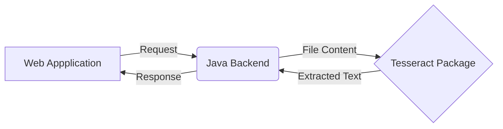

# Tesseract-Web-App-Java-Backend

## Introduction 
`Tesseract` is an open source text recognizer (OCR) Engine, available under the Apache 2.0 license. It can be used directly, or (for programmers) using an API to extract printed text from images. It supports a wide variety of languages.

## Project Introduction

A Java web application which is going to interact with Tesseract Binaries and expose Following REST POST APIs.
- `/getSinhalaText`
- `/getEnglishText`

### Flow Diagram

## Installation Guide  

### Install Tesseract
You have to Install [Tesseract Binaries](https://github.com/tesseract-ocr/tesseract#installing-tesseract) in your local machine. Then you can check installation is success or not by running Tesseract Pacakage locally using this [instructions](https://github.com/tesseract-ocr/tesseract#running-tesseract).

You need to add [tessdata](https://github.com/tesseract-ocr/tessdata#tessdata) to the project folder to use this Tesseract OCR for Sinhala. You can download it from this [GIT repository](https://github.com/tesseract-ocr/tessdata/blob/master/sin.traineddata).  Relevent file is named as **sin.traineddata**.

You have to put downloaded file in to `/usr/share/tesseract-ocr/4.00/tessdata` directory in Linux. You can do testing locally with Tesseract Binaries using following shell command.

    tesseract <imagefileLocation> stdout -l sin --tessdata-dir=<tessdataFileLocation>

### Build the application
You can get relevent frontend application's code base from [here](https://github.com/KaveeshBaddage/Tesseract-Web-App).  

All the instructions to 
 - Build the frontend application  
 - Bundle it with Java web application

 is in **Documentation for Bundle React.js and create JAR file.pdf** file in this repository.

### Run the application
You can run  the project through an IDE or run the Jar file of build project and get the web application.
Web application will be running on [http://localhost:8090/](http://localhost:8090/) according to the default configuration. 

You can change the web application's  running port by changing  following configuration in application.properties file. 

    server.port=8090


# Happy Coding.. !:blush:
```